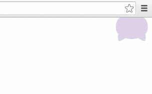

# octocat-icon-font

[](https://www.npmjs.com/package/octocat-icon-font)
[](LICENSE)

GitHub octocat icon font / Fork me icon

<br>

<div align="center">
    
</div>

## Usage

You can install it by using [npm](https://www.npmjs.com/): 
```shell
npm install --save octocat-icon-font
```

Include CSS file: 
```html
<link rel="stylesheet" href="path/to/octocat-icon-font/dist/octocat.min.css">
```

Add classes:
```html
<!-- on bottom left -->
<a href="#" class="octocat-icon open-eyes octocat-md octocat-bl"></a>
<!-- be shy on top right -->
<a href="#" class="octocat-icon octocat-md octocat-tr octocat-shy-t"></a>
```

## Classes

#### Base

- `octocat-icon`: Basic class that define the font icon.

#### Type

- `close-eyes`: Octocat with eyes closed (no eye).
- `open-eyes`: Octocat with eyes open.

#### Size

- `octocat-sm`: Small.
- `octocat-md`: Middle.
- `octocat-lg`: Large.
- `octocat-x-lg`: Very large.
- `octocat-xx-lg`: Very very large.
- `octocat-xxx-lg`: Very very very large.

#### Position

- `octocat-t`: Fix on top.
- `octocat-b`: Fix on bottom.
- `octocat-tl`: Fix on top left.
- `octocat-tr`: Fix on top right.
- `octocat-bl`: Fix on bottom left.
- `octocat-br`: Fix on bottom right.

#### Effect

- `octocat-shy-t`: Be shy on top.
- `octocat-shy-b`: Be shy on bottom.

## Demo

- [demo.html](http://htmlpreview.github.io/?https://github.com/MopTym/octocat-icon-font/blob/master/demo.html) ([source](demo.html))
